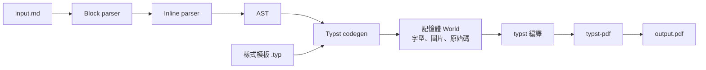

# mdpdf 提案：以 Rust 打造 Markdown → PDF CLI

Sep 24, 2026 · @Etho

## 背景與目標

建立一個單一執行檔的 Rust CLI `mdpdf`，把 Markdown 報告直接轉成 PDF，不依賴 pandoc、瀏覽器、VS Code 或 LaTeX 發行版。Markdown parser 自行實作，排版與 PDF 輸出交給內嵌的 Typst 編譯器。

目標：

- 一個 binary 即可運作，內嵌預設中文字型，也能用 flag 指定字型
- 支援程式碼區塊與語法高亮、GFM 表格、本地圖片、LaTeX 數學公式
- 一般報告（10–30 頁）轉換時間目標 1 秒內
- 錯誤訊息指出 Markdown 原始行號

非目標（至少第一版）：任意內嵌 HTML 的渲染、其他輸出格式（docx、HTML）、所見即所得編輯。

## 整體架構

流程分成四個獨立階段：自製 parser 產生 AST，codegen 把 AST 轉成 Typst 原始碼，再由內嵌的 `typst` crate 在記憶體中編譯並輸出 PDF。



parser 與 Typst 完全解耦：AST 是唯一介面，所以也能寫一個 HTML renderer 專門拿來跑 CommonMark 規格測試。加上 `--emit-typst` flag 可輸出中間的 `.typ` 檔，方便除錯。

選 Typst 而非自己畫 PDF 的原因：斷行、分頁、CJK 排版、數學排版、語法高亮都是它的內建能力，而且可以當 library 編進 binary，不需要外部程式。

## 自製 Markdown parser 設計

以 CommonMark 0.31 為基準，加上 GFM 擴充與數學語法，採用規格建議的兩階段解析：先建區塊樹，再逐段解析 inline。

| 類別 | 支援項目 | 優先序 |
| --- | --- | --- |
| 區塊 | ATX/Setext 標題、段落、引言、嵌套清單（tight/loose）、fenced/縮排程式碼、分隔線、連結參照定義 | 第一版 |
| Inline | 強調（delimiter run 演算法）、行內程式碼、連結、圖片、autolink、硬換行、跳脫字元、HTML entity | 第一版 |
| GFM | 表格（含對齊）、刪除線、任務清單、腳註 | 第一版 |
| 數學 | `$...$` 行內、`$$...$$` 區塊、```` ```math ```` fence | 第一版 |
| Front matter | YAML 的 title、author、date | 第二版 |
| 原始 HTML | 識別後忽略或當純文字，不渲染 | 第一版 |

設計重點：

- **Block 階段**：逐行掃描，維護「開啟中的容器」堆疊，處理 lazy continuation。這是清單與引言嵌套正確的關鍵。
- **Inline 階段**：用規格的 delimiter stack 處理 `*`、`_`、`~~`，連結用 bracket stack。這是整個專案最難的部分。
- **CJK 強調規則**：CommonMark 的 flanking 規則對中文不友善（例如 `**重點**。` 前後無空白）。先實作標準規則，再加一個可關閉的 CJK 寬鬆模式。
- **位置資訊**：每個 AST 節點帶 `Span { line, col }`，用於錯誤訊息與圖片找不到時的提示。
- **零拷貝**：AST 文字以 `Cow<'a, str>` 引用原始輸入，只有跳脫或 entity 才配置新字串。

AST 草案：

```rust
pub enum Block<'a> {
    Heading { level: u8, content: Vec<Inline<'a>> },
    Paragraph(Vec<Inline<'a>>),
    BlockQuote(Vec<Block<'a>>),
    List { ordered: Option<u32>, tight: bool, items: Vec<ListItem<'a>> },
    CodeBlock { lang: Option<Cow<'a, str>>, code: Cow<'a, str> },
    MathBlock(Cow<'a, str>),
    Table { align: Vec<Align>, head: Vec<Cell<'a>>, rows: Vec<Vec<Cell<'a>>> },
    ThematicBreak,
    FootnoteDef { label: Cow<'a, str>, body: Vec<Block<'a>> },
}

pub enum Inline<'a> {
    Text(Cow<'a, str>),
    Emph(Vec<Inline<'a>>),
    Strong(Vec<Inline<'a>>),
    Strike(Vec<Inline<'a>>),
    Code(Cow<'a, str>),
    Math(Cow<'a, str>),
    Link { url: Cow<'a, str>, title: Option<Cow<'a, str>>, content: Vec<Inline<'a>> },
    Image { url: Cow<'a, str>, alt: Cow<'a, str> },
    FootnoteRef(Cow<'a, str>),
    SoftBreak,
    HardBreak,
}
```

Typst 跳脫：純文字輸出前必須跳脫 Typst 標記字元，如 `#`、`*`、`_`、`$`、`@`、`<`、`[`、`]`、反斜線與反引號。較穩健的做法是把文字輸出成字串字面值 `#"..."`，只需跳脫雙引號與反斜線，從根本避免注入問題。

## 功能對應

四項必要功能中，語法高亮與表格幾乎零成本（Typst 內建），圖片需要處理路徑，數學公式是最大的技術風險。

| 功能 | 輸出的 Typst | 實作重點 |
| --- | --- | --- |
| 程式碼區塊 | `#raw("...", lang: "rust", block: true)` | 用字串形式而非反引號 fence，程式碼內有反引號也安全 |
| 語法高亮 | Typst 內建（Sublime syntax） | `--code-theme` 載入 `.tmTheme`；少見語言可用 `--syntax` 載入 `.sublime-syntax` |
| 表格 | `#table(columns: n, align: (...), table.header(...), ...)` | GFM 對齊對應 left/center/right；跨頁時表頭重複 |
| 圖片 | `#image("path", width: ...)` | 相對路徑以 `.md` 所在目錄為基準；寬度上限 100% |
| 數學公式 | 經 LaTeX → Typst math 轉換 | 見下方 |

**圖片**：Typst 支援 PNG、JPEG、GIF、SVG，其他格式依所用 typst 版本而定。找不到圖片時預設印出警告（含行號）並放佔位框，`--strict` 則直接失敗。遠端 URL 預設不下載，需加 `--fetch-remote`（以 cargo feature 包住 HTTP 相依）。圖片隱走文字可用 `--figure-captions` 轉成圖說。

**數學公式**：Markdown 裡的數學是 LaTeX 語法，與 Typst math 不同，必須轉換。方案是採用 MiTeX（LaTeX → Typst 的轉換器，有 Rust crate 與 Typst 套件）：

1. 方案 A：在 Rust 端呼叫 MiTeX 把 LaTeX 轉成 Typst math 字串，再把它需要的 Typst 定義一併注入模板。
2. 方案 B：把 MiTeX Typst 套件內嵌在記憶體 World 中，直接輸出 `#mitex("...")`。最省工，但多一個 WASM plugin 的執行成本。

兩案都在 M4 先做原型比較。不論哪案，轉換失敗的公式會退回為等寬字體原文並發出警告，而不是讓整份文件失敗。數學字型使用 Typst 附帶的 New Computer Modern Math。

## 字型策略

預設內嵌一套 OFL 授權的繁中字型（建議 Noto Serif TC 或 Noto Sans TC 的 Regular + Bold 兩個字重），並可用 flag 完全覆寫。

字型來源依序載入，同名字型以先載入者為準：

1. `--font-path` 指定的檔案或目錄（可重複指定）
2. 系統字型（`/usr/share/fonts`、`~/.local/share/fonts`），可用 `--no-system-fonts` 關閉以確保輸出可重現
3. 內嵌字型：預設 CJK 字型，加上 Typst 附帶的拉丁、數學、等寬字型

Fallback 鏈寫在模板中，拉丁字型在前、CJK 在後，讓英數字與中文各自用合適的字形：

```typst
#set text(font: ("Libertinus Serif", "Noto Serif TC"), lang: "zh", region: "tw")
#show raw: set text(font: ("DejaVu Sans Mono", "Noto Sans TC"))
```

等寬字型也要接 CJK fallback，否則程式碼裡的中文註解會變成豆腐字。

相關 flags：`--font`（內文字型）、`--cjk-font`、`--mono-font`、`--font-path`、`--no-system-fonts`，另加子指令 `mdpdf fonts` 列出所有可用字型名稱。指定的字型找不到時退回內嵌字型並警告。

體積取捨：CJK 字型字檔巨大，會讓 binary 明顯變大。做法是用 cargo feature `embed-cjk`（預設開啟）控制內嵌，並在 build 時用 zstd 壓縮、執行時才解壓；想要精簡版的人可以 `--no-default-features` 編譯。PDF 輸出時 typst 會自動子集化字型，所以不會讓 PDF 變大。

## CLI 介面設計

預設行為是 `mdpdf report.md` 直接產生同名的 `report.pdf`，其餘都是選用 flags。

```text
mdpdf [OPTIONS] <INPUT>
mdpdf fonts [--font-path <PATH>...]

Options:
  -o, --output <FILE>        輸出路徑（預設：輸入檔名.pdf；- 代表 stdout）
      --font <NAME>          內文字型
      --cjk-font <NAME>      中文字型
      --mono-font <NAME>     程式碼字型
      --font-path <PATH>     額外字型檔或目錄（可重複）
      --no-system-fonts      不讀系統字型
      --paper <SIZE>         a4 | letter | ...（預設 a4）
      --margin <LEN>         頁邊距（預設 2.5cm）
      --toc                  產生目錄
      --number-headings      標題編號
      --code-theme <FILE>    .tmTheme 語法高亮主題
      --template <FILE>      自訂 Typst 模板
      --emit-typst <FILE>    另存中間 .typ 檔
      --fetch-remote         下載遠端圖片
      --strict               警告視為錯誤
  -w, --watch                檔案變更時自動重建
```

範例：

```sh
mdpdf report.md
mdpdf report.md -o out/q3.pdf --toc --cjk-font "LXGW WenKai TC"
mdpdf report.md --font-path ~/fonts --no-system-fonts --strict
cat notes.md | mdpdf - -o notes.pdf
```

設定優先順序：CLI flags > Markdown front matter > `~/.config/mdpdf/config.toml` > 內建預設。config 檔讓你不用每次打同樣的字型與紙張設定。

## 專案結構與相依套件

採用 cargo workspace 切成三個 crate，parser 沒有任何外部相依，未來可獨立發佈或重用。

```text
mdpdf/
├── Cargo.toml              # workspace
├── crates/
│   ├── mdparse/            # 自製 parser：block、inline、AST、HTML renderer（測試用）
│   ├── md2typst/           # AST → Typst codegen、跳脫、數學轉換
│   └── mdpdf/              # CLI、World 實作、字型載入、PDF 輸出
├── assets/
│   ├── fonts/              # 內嵌 CJK 字型
│   └── template.typ        # 預設樣式模板
└── tests/
    ├── spec/               # CommonMark、GFM 規格測試
    └── fixtures/           # 範例 .md 與 snapshot
```

| Crate | 用途 | 所屬 |
| --- | --- | --- |
| `typst` | 編譯器核心，需實作 `World` trait | mdpdf |
| `typst-pdf` | 將排版結果輸出 PDF | mdpdf |
| `typst-kit` | 字型搜尋、內嵌字型工具 | mdpdf |
| `typst-assets` | Typst 附帶字型（拉丁、數學、等寬） | mdpdf |
| `mitex` | LaTeX → Typst math | md2typst |
| `clap` | 參數解析 | mdpdf |
| `anyhow` / `thiserror` | 錯誤處理 | 全部 |
| `zstd` | 內嵌字型壓縮 | mdpdf |
| `notify` | `--watch` | mdpdf（選用） |
| `ureq` | `--fetch-remote` | mdpdf（選用） |
| `insta`、`serde_json` | snapshot、讀規格測試 | dev |

`typst` 系列 crate 的 API 在版本間變動頻繁，所有 `typst-*` 必須鎖定同一版本，升版時一起處理。

## 測試策略

自製 parser 的正確性靠官方規格測試驗證：CommonMark 規格附有數百個「Markdown → 預期 HTML」範例，這正是要寫 HTML renderer 的原因。

| 層級 | 方法 | 達標條件 |
| --- | --- | --- |
| Parser | 跑 CommonMark `spec.json` 與 GFM 擴充範例，比對 HTML | 第一版 CommonMark 通過率 ≥ 95%，表格與刪除線 100% |
| Codegen | `insta` snapshot：每個 fixture 的 `.typ` 輸出 | 輸出變更需人工確認 |
| 跳脫 | property test：隨機文字轉出後必須能被 typst 編譯且文字不變 | 無失敗案例 |
| 強健性 | `cargo-fuzz` 餵隨機輸入給 parser | 不 panic、無指數級耗時 |
| 端到端 | 中文報告範例全流程產生 PDF，檢查成功與頁數 | CI 每次執行 |
| 效能 | `criterion` benchmark | 30 頁報告 < 1 秒 |

端到端 fixture 應包含：中英混排段落、`**中文粗體**。`這類 CJK 強調邊界、含中文註解的程式碼、寬表格、SVG 與 PNG 圖片、常見 LaTeX 公式（分數、矩陣、`align` 環境）。

## 里程碑規劃

先打通「寫死的 Typst → PDF」管線，再逐步補 parser，讓每個階段結束都有可執行的工具。時程為業餘時間的粗估。

| 階段 | 內容 | 完成標準 | 粗估 |
| --- | --- | --- | --- |
| M0 骨架 | workspace、記憶體 World、內嵌字型、寫死的 `.typ` 輸出 PDF | 中文正常顯示的 PDF | 1 週 |
| M1 區塊 | block parser、基本 inline、codegen 初版 | 標題、段落、清單、程式碼轉出正確 | 2 週 |
| M2 Inline | delimiter 演算法、連結、圖片、HTML renderer、規格測試 | CommonMark 通過率 ≥ 95% | 2–3 週 |
| M3 GFM | 表格、刪除線、任務清單、腳註、CJK 強調模式 | GFM 擴充測試通過 | 1–2 週 |
| M4 數學 | MiTeX 兩方案原型、失敗 fallback | 常見公式 fixture 正確 | 1 週 |
| M5 設定 | 字型 flags、`mdpdf fonts`、模板、config、front matter、`--toc` | 所有 flags 有測試 | 1–2 週 |
| M6 收尾 | 錯誤訊息行號、`--watch`、fuzz、效能、AUR 套件 | v1.0 發佈 | 1–2 週 |

M2 是關鍵路徑：強調演算法與清單邊界情況最耗時。若想更快拿到可用版本，M3 與 M4 可在 M2 達 80% 後平行進行。

## 風險、待決問題與 EndeavourOS 環境

| 風險 | 影響 | 對策 |
| --- | --- | --- |
| 強調與清單解析邊界情況多 | M2 延後 | 嚴格照規格的演算法實作，靠規格測試驅動開發 |
| LaTeX 轉 Typst 涵蓋不全 | 少數公式渲染錯誤 | 失敗時退回原文並警告；收集實際報告的公式當 fixture |
| typst crate API 不穩定 | 升版時需改 World 實作 | 鎖版本，World 相關程式集中在單一模組 |
| 內嵌 CJK 字型讓 binary 變大 | 發佈檔體積 | zstd 壓縮、feature flag 可關閉 |
| CJK 強調寬鬆模式與規格衝突 | 與其他工具輸出不一致 | 做成可關閉的選項，文件說明差異 |

待決問題：

- [ ] 預設內嵌字型選明體（Noto Serif TC）還是黑體（Noto Sans TC）
- [ ] 數學轉換採方案 A 或 B（M4 原型後決定）
- [ ] CJK 強調寬鬆模式預設開啟與否
- [ ] 是否需要頁首頁尾（頁碼、報告標題）作為預設樣式

EndeavourOS 開發環境（Arch 系）：

```sh
sudo pacman -S --needed rustup base-devel
rustup default stable
sudo pacman -S noto-fonts-cjk   # 測試系統字型載入用
cargo install cargo-fuzz cargo-insta
```

typst 自行掃描字型目錄，不依賴 fontconfig，也沒有 Pango 之類的系統函式庫需求。發佈方面，先用 `cargo install --path crates/mdpdf` 自用，v1.0 後再寫 PKGBUILD 上傳 AUR（`mdpdf-git` 與 `mdpdf-bin`）。
